# HTTP Status Code Distribution
One of the common challenges for Akamai Customers is to monitor the traffic of their websites in real time. Datastream is Akamai's real time data export offering to the favorite destinations of customers. If the customer is not really in the need of real time logs and are okay with a delay of 2 mins, then eStats data would be a good consumption. This estats endpoint returns HTTP status codes distribution statistics from delivering a URL or CP code based on the nine-second traffic sample from the last two minutes.
Feel free to go through the [API endpoint](https://techdocs.akamai.com/edge-diagnostics/reference/post-estats).

- This POC is aimed at how to quickly setup [Grafana](https://grafana.com/) Dashboards for monitoring HTTP Status Code Distribution on Linode VMs.

### Proposed Workflow
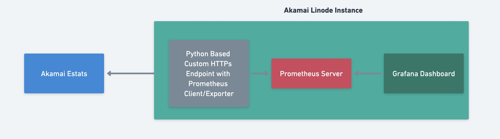

### Prerequisite
- Create an API Client with Read-write access to EdgeDiagnostics Endpoint. Once you create an API client you would have the credentials like shown below and save it in ~/.edgerc file or any file of your choice. Detailed steps can be found [here](https://techdocs.akamai.com/developer/docs/set-up-authentication-credentials).
```
[default] 
client_secret = abcdEcSnaAtasdas123FNkBxy456z25qx9Yp5CPUxlEfQeTDkfh4QA=I 
host = akab-lmn789nsss2k53w7asdasdqrs10cxy-nfkxaa4lfk3kd6ym.luna.akamaiapis.net 
access_token = akab-zyx987asdasxa6osbli4k-e7jf5ikib5jknes3
Client_token = akab-nomadoflavjuc4422-fa2xznerxrm3teg7
```

- Create an account by signing up with [Linode](https://cloud.linode.com/). You can read on getting started [here](https://www.linode.com/docs/guides/getting-started/)


### Create a Grafana and Prometheus Linode Instance
- Create Linode Instance by selecting Grafana and Prometheus Market Place at https://cloud.linode.com/ 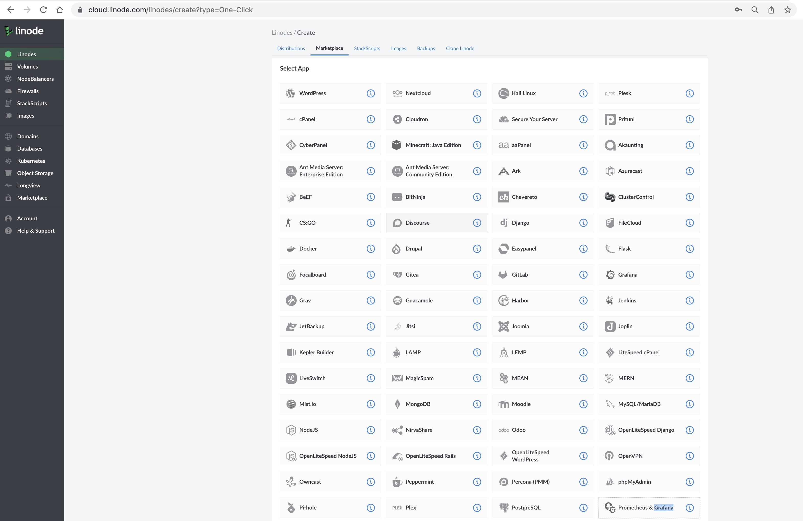

- Fill in other details
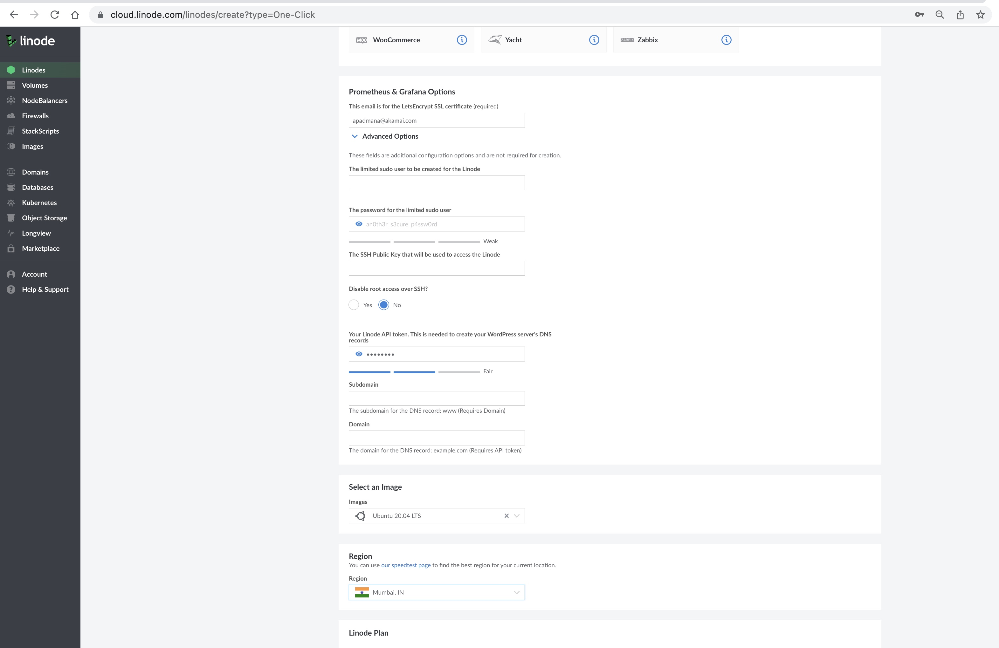
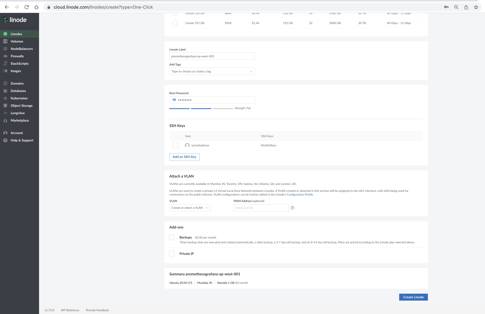

### Login to the Linode Instance
- Details about the IP Address, Hostname of the instance can be found here
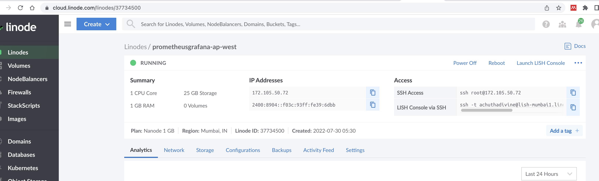

- I am logging in via SSH to the instance
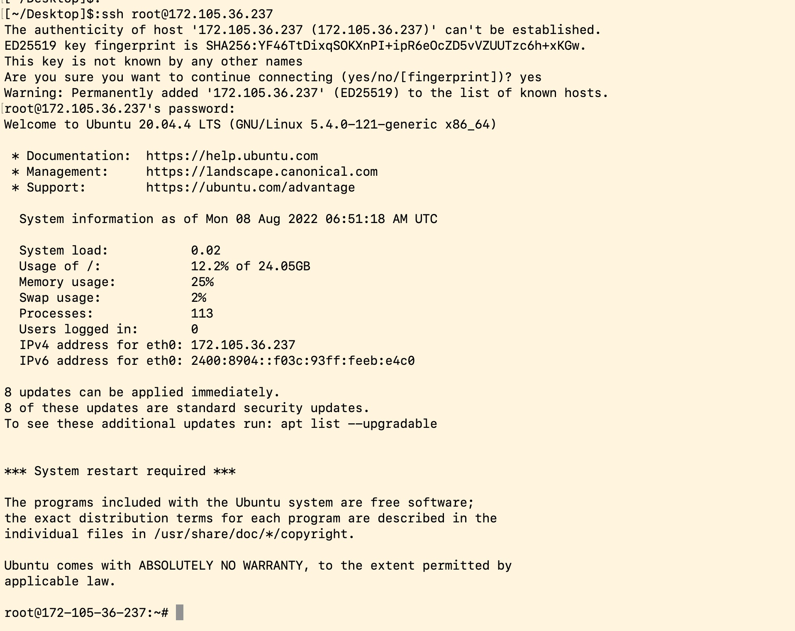

### Prometheus and Grafana Credentials
The marketplace comes with the Prometheus and Grafana preinstalled and the creds can be found at ~/credentials.txt 
```
root@172-105-316-237:~# cat credentials.txt 
#################
#   Prometheus  #
#################
Location: https://172-105-316-237.ip.linodeusercontent.com/prometheus
Username: prometheus
Password: 8a+49O/N/6EasdasdvXb/YQidIjAVozuTCSDZIjGZEPJxJUsE=
##############
#  Grafana   #
##############
Location: https://172-105-316-237.ip.linodeusercontent.com/
Username: admin
Password: EAhQrzu1xRasdasdw1lxIpmmjmigkpREhcwl/vXx58j7rwP4U=
root@172-105-36-237:~# 
```

### Setup the Edgerc file.
Create an edgerc with the creds created from Akamai Control Center at ~/.edgerc

### Clone the Exporter Code.
```
root@172-105-36-237:~# git clone https://github.com/Achuthananda/EstatsMon_Linode.git
Cloning into 'EstatsMon_Linode'...
remote: Enumerating objects: 16, done.
remote: Counting objects: 100% (16/16), done.
remote: Compressing objects: 100% (13/13), done.
remote: Total 16 (delta 2), reused 16 (delta 2), pack-reused 0
Unpacking objects: 100% (16/16), 738.73 KiB | 735.00 KiB/s, done.
root@172-105-36-237:~# 
```

### Configure the Exporter
```
[Exporter]
polling_interval = 120
exporter_port = 9877

[Akamai]
edgerclocation = ~/.edgerc
cpcode = 1209788
deliverynetwork = STANDARD_TLS
accountSwitchKey = B-C-1IE2OH8:1-2RBL
```
If you are an Akamai customer then you can leave accountSwitchKey as blank. Rest everything needs to be filled up as per your need.
polling_interval denotes the frequency of pulling the data from Akamai estats.

### Setup the Prometheus Config
```
root@172-105-36-237:~/EstatsMon_Linode# cp prometheus.yml /etc/prometheus/prometheus.yml
root@172-105-36-237:~/EstatsMon_Linode# sudo systemctl restart prometheus
```

### Setup the Exporter
```
root@172-105-36-237:~/EstatsMon_Linode# apt install python3-pip
root@172-105-36-237:~/EstatsMon_Linode# pip3 install -r requirements.txt
root@172-105-36-237:~/EstatsMon_Linode# sudo ufw allow 9877
```

### Run the Exporter
```
root@172-105-36-237:~/EstatsMon_Linode#python exporter.py 
HTTP Exporter Server is Running on Port 9877
```

### Configure and Run the Prometheus Server

- Check the Config Settings of Prometheus Server on https://172-105-316-237.ip.linodeusercontent.com/prometheus/config
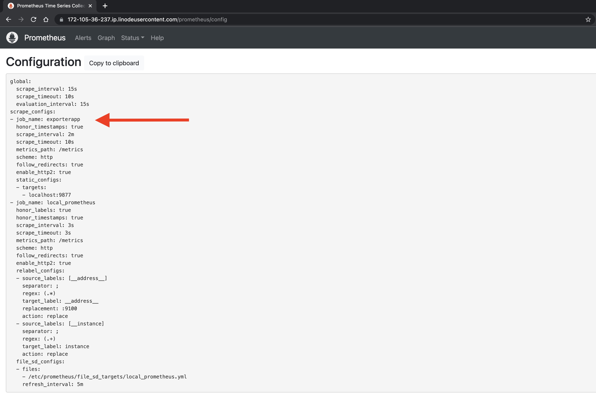

- You can also check if the exporter is working fine by a health check of the target at https://172-105-316-237.ip.linodeusercontent.com/prometheus/targets
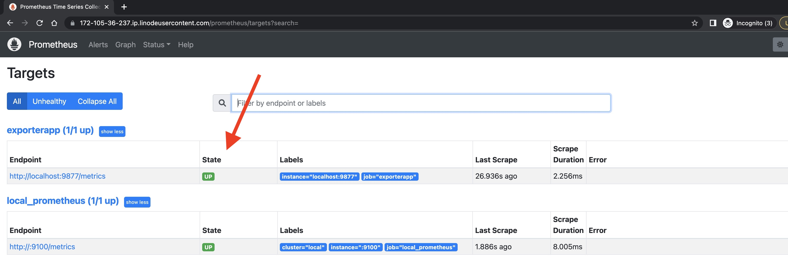


### Grafana 
- Login to Grafana at https://172-105-36-237.ip.linodeusercontent.com/
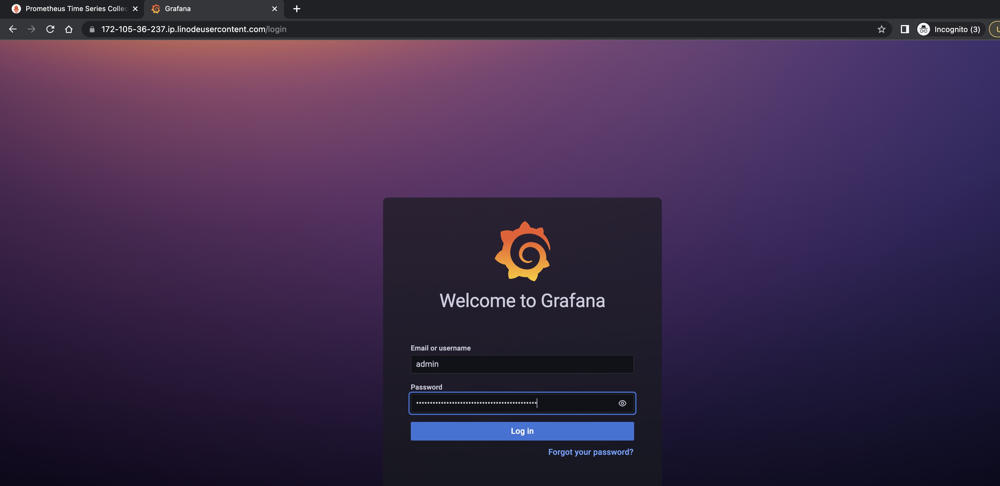

- Click on Add your first data source [Prometheus datasource] or https://172-105-36-237.ip.linodeusercontent.com/datasources and Copy the datasource Id from the url 3WzerRm4z
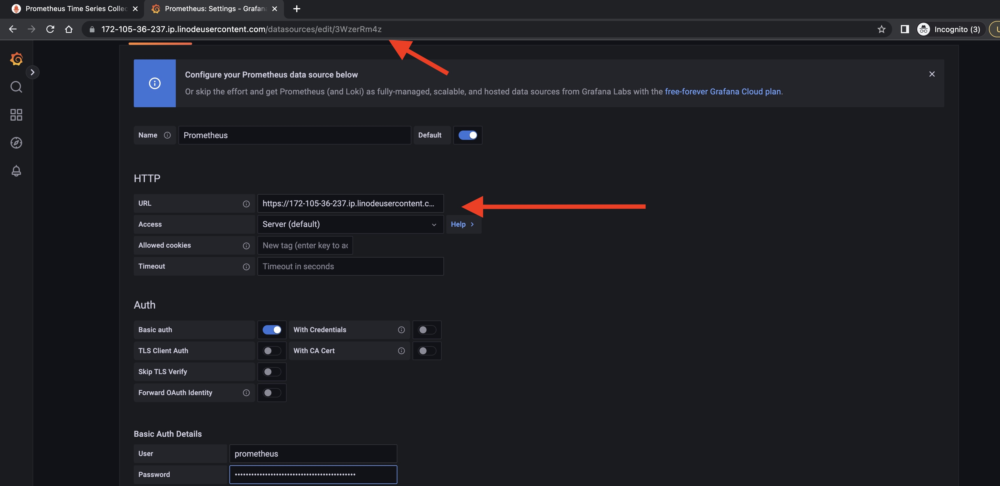

- Update the Dashboard json with the Datasource Id
```
[~/]$:python updatedashboardid.py -d 3WzerRm4z
[~/]$:
```

- Import dashboard at https://172-105-36-237.ip.linodeusercontent.com/dashboard/import
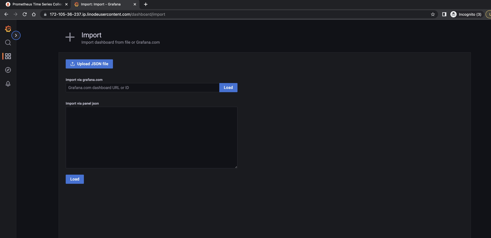

- Grafana Visualization will be ready in no time
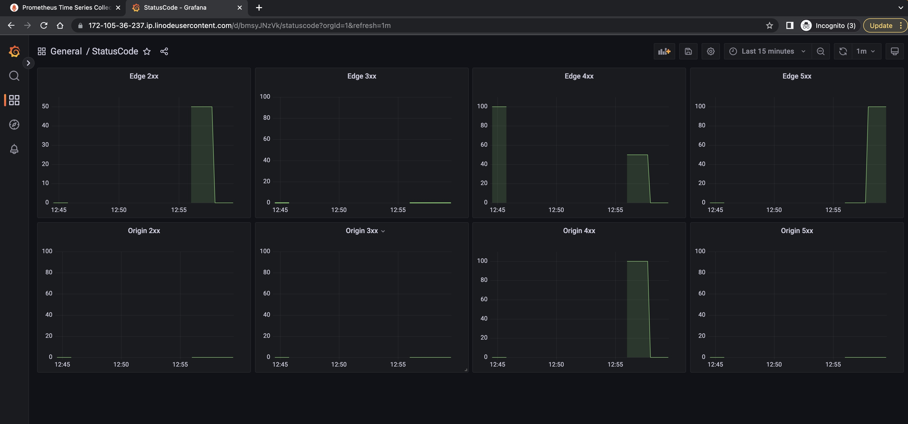
